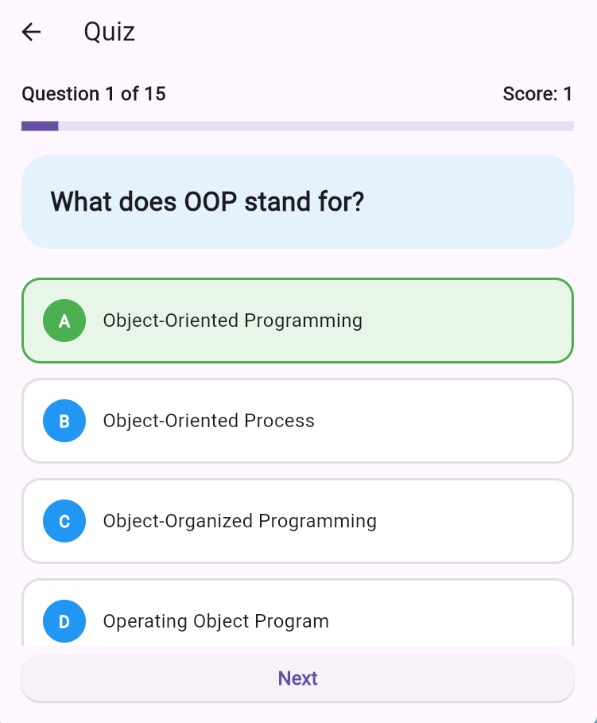
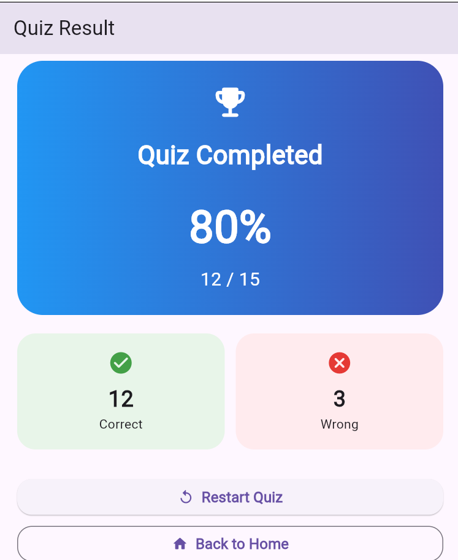

# Quiz App

A simple Flutter Quiz App where users can answer multiple-choice questions and see their final score.

## Features

* Load quiz questions from Firebase Firestore
* Multiple-choice questions
* Select an answer
* Show correct and wrong answers
* Automatic score calculation
* Show question progress
* Final result screen
* Show correct and wrong answer count
* Show percentage score
* Restart the quiz
* Start the quiz again from the home screen
* Loading state
* Error handling
* Retry option

## Technologies

* Flutter
* Dart
* Firebase
* Cloud Firestore

## Screenshots

<p align="center">
  
  
  
  
</p>

## How It Works

1. The app loads quiz questions from Firebase Firestore.
2. The user selects an answer.
3. The app checks whether the selected answer is correct.
4. The score increases when the answer is correct.
5. After completing all questions, the app shows the final result.

## Firebase

Quiz questions are stored in Firebase Firestore.

Collection:

`questions`

Each question contains:

* Question
* Options
* Correct Answer

## Project Structure

```text
lib/
├── core/
└── features/
    ├── home/
    ├── quiz/
    └── result/
```

## Purpose

This project was created to practice Flutter, Firebase Firestore, state management, and Clean Architecture concepts.

## Author

**Mohib Ullah Foysal**

Computer Science & Technology Student
Flutter & App Development Learner
